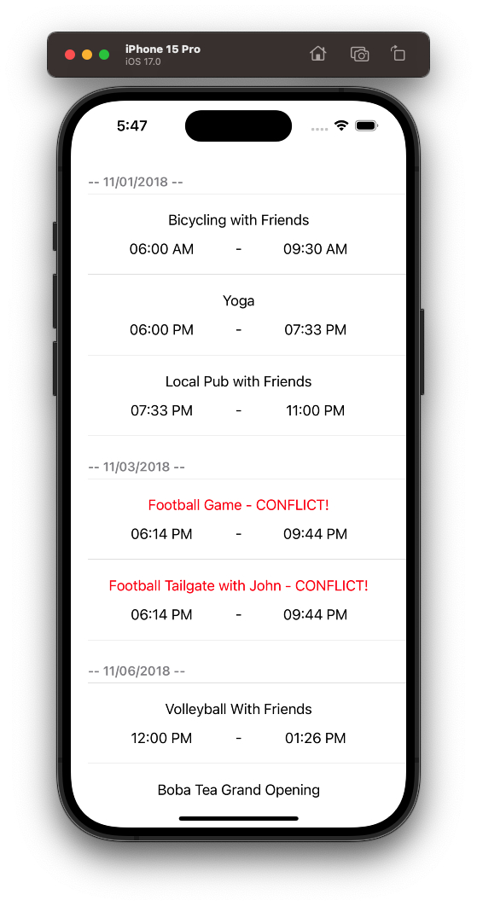

# Conflicting iOS Code Challenge

The original challenge text can be found [here](MH-iOS-TakeHome.pdf).



## Loading and Testing of this project

* Prerequisites: [ruby](https://github.com/sstephenson/rbenv), [ruby gems](https://rubygems.org/pages/download), [bundler](http://bundler.io)

This project has been setup to use [fastlane](https://fastlane.tools) to run the specs.

First, run the following commands to bundle required gems and install [Cocoapods](https://cocoapods.org) when in the project directory:

```bash
$ bundle install
$ bundle exec pod repo update
$ bundle exec pod install
```

And then use fastlane to run all the specs on the command line:

```bash
$ bundle exec fastlane specs
```

## High Level Approach

Upon first "skim" of the exercise I noticed that majority of the work involved for this exercise wasn't exactly so much "app creation," but more "algorithm-y" in stature after digesting the sorting portion of the instructions with "Big-O" notation requirements.  Since I give myself a time limit (~ 8 hours) for take home exercises based on "gut feelings" for work, I decided that I would knock out the app portion of the exercise first, before I decided to drill on the JSON processing, sorting and conflict detection.

Note: Due to time constraints, while the app will take advantage of constraints to lay out the views, it will be developed with the iPhone 15 in mind.  I will also use `UIKit`, as it is my preferred API to build interfaces quickly.

## Development notes

### Project

In order to be a good citizen, I used `SwiftLint` to keep some consistency with language patterns.  I also used `fastlane` to run the specs (unit tests) from the command line.

### UI

Since the exercise didn't provide much details on the design of the app, I opted to create the simplest UI for the use cases in an effort to demonstrate an effective MVP (Minimum Viable Product) that could be iterated on quickly with design updates in the future.

I decided to use a straightforward `UITableView` display with sections and rows to designate the events by date and each event for that date.  Conflicts would be handled by appending a red `- CONFLICT` text to the event name for ease.

### Specs (Unit Tests)

I've fully tested all the models, custom views, extensions, utilities and view controllers.  Most of it was pretty straight foward using protocol oriented programming and the usage of "fakes" in the specs.  As I do with other projects, I used `Quick` to give a more BDD oriented testing approach.  I also leveraged my own testing matcher framework [Moocher](https://github.com/rbaumbach/Moocher), as the RSPEC format is easier to read than using the standard `XCTest` matchers.

### Event display algorithm performance

As hinted to above, I noticed that this exercise is a white-boarding "Hacker Rank" type exercise in disguise.  With that said I knew that there would be a solution that would be better than `O(n^2)` that needed to be discovered, and more often than not, would require some "trick" to get there.

After some trial and error, I came up with the following algorithm (can be found in `EventDataSource` structure):

#### 1 - Pre-sorting the events

While this didn't have an effect so much on the running time, it drastically simplified my algorithm.  So after loading the JSON from disk, I went ahead and sorted all the items by `startDate`.  This already gives this algorithm, `O(nlogn)`.

#### 2 - Processing sorted events in custom dictionary-like structure

I then looped through all the events and grouped them by date.  This way I was able to create a dictionary type structure (`DateEvents`) with a date key, and an array of events associated with that date.  Since the events were pre-sorted in step one, all the events for that structure are already sorted and don't require another sorting pass.  Once this was done, we had an array of these `DateEvents` objects. With the data in this format, it is extremely easy to load all events into the `UITableView` by section (each instance of `DateEvent`), and row (each instance of `Event`).  I also want to note that the same functionality could have been done using a dictionary, but the custom structure made it easy to read, and load up to a `UITableView` without any additional processing.  This portion is of the algorithm is `O(n)`.

#### 3 - Detect event conflicts

Rather than nest the looping, I went ahead and detected conflicts for each groups events after building the custom structure from step 2.  This was done by looping once over all the elements comparing startDate for event n+1 and endDate for n.  Since I kept track of the conflicts in a separate data structure, I was able to keep everything `O(n)` by continuously looping over the n elements in linear time, then updating the `hasConflict` for each event 

Since it wasn't specified if I mark all events as "conflicted" or only the events after the 1st one, I went ahead and marked them all.

#### 4 - Final running time

If we add up all the running times, we can see the slowest part of the algorithm is the sorting which is `O(nlogn)`.  This satisfies the requirements, as it is faster than `O(n^2)`.

## Final thoughts

Majority of this exercise was spent playing around with various implementations, and calculating the "Big-O" notation for each iteration.  This probably used up about 50% of my time during this exercise. I could have spent less time on this if I figured out the "pre-sorting" trick first, as this simplified my implementation enough to reason various design decisions quicker.  This didn't give much time to build UI and fully unit test all the code I wrote.  I understand that I have "unlimited" time with this exercise to do this, but like a story/epic/timeline/whatever, I always use a time-box approach for these coding exercises.

I would like to note that I found a bug in my test matcher framework `Moocher` while writing tests, and I was able to fix and [push out a new release](https://github.com/rbaumbach/Moocher/releases/tag/0.4.0) for this library =).