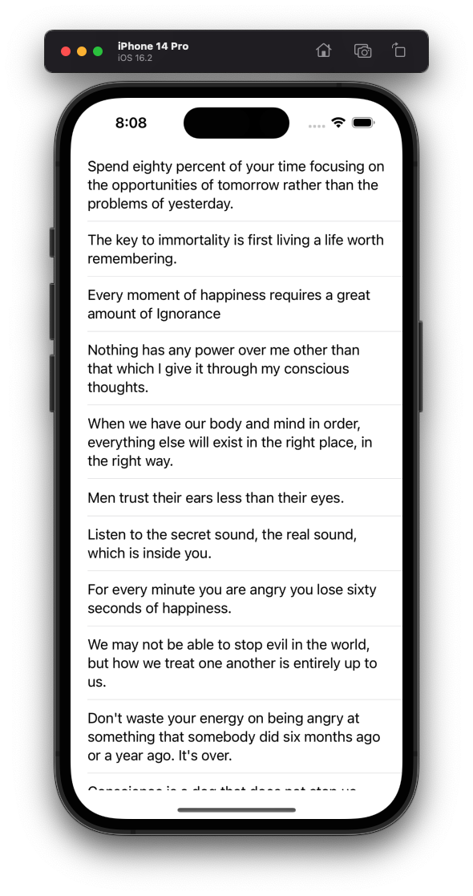

# Quotes

This is a simple exercise of displaying quotes from a [Quotes API](https://zenquotes.io) in a `UITableView` with dynamic `UITableViewCell` text sizing.

## Challenge Introduction

I was given 25 minutes[^1] to build an iOS app from scratch using any resource necessary to achieve the exercise goals described above.  I was given two URLs:

1. [Quote API documentation](https://docs.zenquotes.io/zenquotes-documentation/)
2. A sample JSON response that was "minified" and required a tool like "JSONPretty" to digest.

The completed code can be found in the [OnTheFly](OnTheFly/) directory of this repo.

## Challege Thought Process

Since this is challenge had an aggressive time limit:

1. I didn't take the time to handle aggressive optional if-lett'ing.  I force unwrapped a lot of the traditional `Foundation` apis that existed before Swift did (ex: `URLSession` and `IBOutlets`), and guarantees such as the API that was used to build a `URL`.
2. I didn't take the time to create models that would be representative of a production system.
3. I did all logic in the `ViewController` for convenience.  This allowed for quick usage/lookup/reference.  Ultimately, the `ViewController` was ~100 lines so this is ok.
4. I manually deserialized the response JSON
5. I didn't care about error handling with the API request/response.

## Challenge Execution

I was able to complete everything except the dynamic text within the time limit.  I was currently in the process of remembering the technique for basic dynamic `UITableViewCell.textLabel?.text` when I ran out of time.

When I was instructed to stop for questions, I commented that normally dynamic sizing can be achieved with custom `UITableViewCell` subclasses by making sure that all the labels follow proper constraint "maths." I also communicated that I would probably look for the easiest solution by taking a look at the `UITableViewCell.textLabel?.numberOfLines` and set it to `0`.  After the challenge was over, I went and tried that approach, and it indeed made the cells self sized.

## Hindsight Execution

As they say, hindsight is always 20/20, but after thinking about this exercise after the stress hormone has dissolved, I found that I ultimately wouldn't change much.  This is a very basic quote "fetcher," and most of the code that I did was functional enough for that goal.  Here is a list of things I changed:

1. I switched from manually deserializing the Quotes API response to using the `Codable` API.  This however wasn't necessary due to the simple JSON payload, but I did it for more practice with the `CodingKeys` API.
2. I put all the networking code and `Quote` model code into another model called `QuoteModel`.  It is a very basic facade that has only one method that can be used by the consumer, the `ViewController`.  The encapsulates all the complexity the networking and JSON parsing, and allows for easy testing.  I created `QuoteModelProtocol` to demonstrated this.
3. I added the `cell.textLabel?.numberOfLines = 0` to allow the cells to "auto-size" to completely finish the exercise.
4. I added an error label behind the `tableView` that can be used if there is an error that happens when fetching the Quotes from the API.

If this was a take-home "challenge," I would have definitely unit tested all my code.  However, since this wasn't the case and the exercise is already over, I decided not to.  All the testing patterns are pretty much the same as what I did in the `Weatherz` project, and additional practice for this challenge don't add much value.

The completed code can be found in the [Hindsight](Hindsight/) directory of this repo.

## Final Thoughts

This was a decent exercise to show some core competency with app development.  However, the short timeframe and emphasis on having networking code "memorized" could have been handled better.  It allows the interviewer to determine if a candidate knows how to use a `UITableView`, `URLSession` and very basic `DispatchQueue`s.  However, while I was developing my solution I was be criticized for not using the MVVM pattern right out the box.  I don't think this challenge is a good representation of pattern usage based on the constraints I mentioned, and the lack of complexity needed to finish it.

I think this challenge would have been more effective for both parties as a 1 hour take home exercise instead.  I also believe that if they wanted to critique a very specific pattern implementation from the interviewee (such as MVVM), it should have been communicated up front to use it.

[^1]: The exercise itself was 30 minutes.  However, this challenge was a surprise and wasn't communicated to me beforehand and my workstation wasn't setup.  I spent about ~5 minutes getting Xcode ready for development.